# 3DV-2023 Assignment: Single View to 3D

[TOC]

> :zap: PDF provides index navigation. You can utilize it to navigate to the part you want to read.

## Goal

In this assignment, you will explore the types of loss and decoder functions for regressing to voxels, and point clouds representation from single view RGB input.

## Detailed explanation of your code

### Dataset

> Read images and point clouds/voxels from files.
>
> The code I changed:
>
> 1. Remove unused code comments
>
> 2. Remove permuting image shape from (B, C, H, W) to (B, H, W, C)
>
>    In torch tensor's common format, it is (B, C, H, W).
>
>    In this training flow, I find only the model use the images, and it also permutes back to (B, C, H, W).
>
>    So, It is unnecessary.
>
> Point cloud format: (B, N, 3)
> N: number of points in one image
> 3: xyz coordinate in 3D space.
>
> Voxel format: binary format, (B, A, B, C)
> A, B, C: the size of voxels (D, H, W)

```python
class ShapeNetDB(Dataset):
    def __init__(self, data_dir: str, data_type: str, n_points: int = 2048):
        super().__init__()
        self.data_dir = data_dir
        self.data_type = data_type
        self.n_points = n_points
        self.db = self.load_db()

        self.get_index()

    def __len__(self):
        return len(self.db)

    def __getitem__(self, idx):
        if self.data_type == "point":
            """
            Return shapes:
            img: (B, 256, 256, 3)
            pc: (B, 2048, 3)
            object_id: (B,)
            """
            img, img_id = self.load_img(idx)
            pc, object_id = self.load_point(idx)

            assert img_id == object_id

            return img, pc, object_id

        elif self.data_type == "voxel":
            """
            Return shapes:
            img: (B, 256, 256, 3)
            voxel: (B, 33, 33, 33)
            object_id: (B,)
            """
            img, img_id = self.load_img(idx)
            voxel, object_id = self.load_voxel(idx)

            assert img_id == object_id

            return img, voxel, object_id

    def load_db(self):
        db_list = sorted(glob.glob(os.path.join(self.data_dir, "*")))

        return db_list

    def get_index(self):
        self.id_index = self.data_dir.split("/").index("data") + 2

    def load_img(self, idx):
        path = os.path.join(self.db[idx], "view.png")
        img = read_image(path) / 255.0

        object_id = self.db[idx].split("/")[self.id_index]

        return img, object_id

    def load_point(self, idx):
        path = os.path.join(self.db[idx], "point_cloud.npy")
        points: np.ndarray = np.load(path)

        # resample
        # if self.n_points < points.shape[0]:
        #     choice = np.random.choice(points.shape[0], self.n_points, replace=False)
        #     points = points[choice]

        # normalize
        points -= np.mean(points, axis=0, keepdims=True)  # center
        dist = np.max(np.sqrt(np.sum(points**2, axis=1)), 0)
        points = points / dist  # scale

        object_id = self.db[idx].split("/")[self.id_index]

        return torch.from_numpy(points), object_id

    def load_voxel(self, idx):
        path = os.path.join(self.db[idx], "voxel.npy")
        voxel = np.load(path)

        object_id = self.db[idx].split("/")[self.id_index]

        return torch.from_numpy(voxel).float(), object_id
```

### Loss

> voxel_loss: Binary cross entropy with logits (contain sigmoid function)
>
> chamfer_loss: Use the nearest points to calculate loss.
>
> $d_{CD}(X,Y) = \sum_{x \in X} \operatorname*{min}_{y \in Y} ||x-y||^2_2 + \sum_{y \in Y} \operatorname*{min}_{x \in X} ||x-y||^2_2$

```python
def voxel_loss(voxel_src: torch.Tensor, voxel_tgt: torch.Tensor):
    loss = binary_cross_entropy_with_logits(voxel_src, voxel_tgt)
    return loss


def chamfer_loss(point_cloud_src: torch.Tensor, point_cloud_tgt: torch.Tensor):
    assert point_cloud_src.ndimension() == 3  # (B, N, 3)
    assert point_cloud_src.size(-1) == 3
    assert point_cloud_tgt.ndimension() == 3  # (B, N, 3)
    assert point_cloud_tgt.size(-1) == 3

    # [B, N, N, 3]
    distance = point_cloud_src[:, :, None, :] - point_cloud_tgt[:, None, :, :]
    # [B, N, N]
    distance = torch.sum(distance**2, dim=-1)

    # [B, N]
    min_xy, _ = torch.min(distance, dim=-1)
    min_yx, _ = torch.min(distance.transpose(1, 2), dim=-1)

    # [B]
    loss_xy = min_xy.mean(dim=1)
    loss_yx = min_yx.mean(dim=1)

    return (loss_xy + loss_yx).mean()
```

### Model

#### SingleViewto3D

> An Encoder-Decoder architecture.
>
> Encoder uses ResNet series.
>
> The code I changed:
>
> 1. Freeze the BatchNorm2d layers
>    While using ResNet50 as encoder, I found the batch normalization will make the performance bad.
>    Batch Normalization will be determined by the batch size.
>    If the batch size is very small (e.g. 16, 8...), it will perform not well.
> 2. Build the model automatically.
>    I find it is determined by BasicBlock or BottleBlock.
>    Refer to [here](https://github.com/pytorch/vision/blob/906c2e95598f2b32b4e3a45a0fcf705bad87df3c/torchvision/models/resnet.py#LL206C12-L206C12).

```python
class SingleViewto3D(nn.Module):
    def __init__(self, cfg):
        super().__init__()
        self.dtype = cfg.dtype
        vision_model: torch.nn.Module = torchvision_resnet.__dict__[cfg.arch](
            pretrained=True
        )
        self.encoder = torch.nn.Sequential(*(list(vision_model.children())[:-1]))
        for module in self.encoder.modules():
            if isinstance(module, nn.BatchNorm2d):
                module.requires_grad_(False)

        latent_size = 512
        for module in vision_model.modules():
            if isinstance(module, torchvision_resnet.BasicBlock):
                latent_size *= torchvision_resnet.BasicBlock.expansion
                break
            elif isinstance(module, torchvision_resnet.Bottleneck):
                latent_size *= torchvision_resnet.Bottleneck.expansion
                break

        # define decoder
        if cfg.dtype == "voxel":
            self.decoder = VoxelDecoder(cfg.n_points, latent_size)
        elif cfg.dtype == "point":
            self.decoder = PointDecoder(cfg.n_points, latent_size)

        self.normalize = Normalize(
            mean=[0.485, 0.456, 0.406], std=[0.229, 0.224, 0.225]
        )

    def forward(self, images: torch.Tensor):
        images = self.normalize(images)
        encoded_feat = self.encoder(images)
        encoded_feat = torch.flatten(encoded_feat, 1)
        pred = logits = self.decoder(encoded_feat)
        if self.dtype == "voxel":
            pred = torch.sigmoid(logits)
        return logits, pred
```

#### PointDecoder

> The code I changed:
>
> 1. Build the layers automatically.
> 2. Add Group Normalization to let the model coverage more easily.

```python
class PointDecoder(nn.Module):
    def __init__(self, num_points: int, latent_size: int = 512):
        super().__init__()
        self.num_points = num_points
        out_features = self.num_points * 3

        layers = []
        scale = 2
        max_scale = out_features // latent_size
        prev_size = latent_size
        while scale < max_scale:
            next_size = latent_size * scale
            layers.extend(
                [
                    nn.Linear(prev_size, next_size),
                    nn.GroupNorm(32, num_channels=next_size),
                ]
            )
            prev_size = next_size
            scale *= 2

        layers.append(nn.Linear(prev_size, out_features))

        self.layers = nn.ModuleList(layers)
        self.th = nn.Tanh()

    def forward(self, x: torch.Tensor):
        for layer in self.layers[:-1]:
            x = F.relu(layer(x))

        x = self.layers[-1](x)
        x = self.th(x)
        x = x.view(-1, self.num_points, 3)
        return x
```

#### VoxelDecoder

> The code I changed:
>
> 1. Remove Tanh activation layer.
>    Because of binary format of voxels, the decoder predicts multiple binary score.
>    Tanh is used for predicting (-1, 1) values, such as coordinates.
>    So, I change to use sigmoid with binary entropy loss function.
> 2. Add Group Normalization to let the model coverage more easily.

```python
class VoxelDecoder(nn.Module):
    def __init__(self, num_points: int, latent_size: int = 512):
        super().__init__()
        self.num_points = num_points
        self.fc0 = nn.Linear(latent_size, latent_size * 2)
        self.gn0 = nn.GroupNorm(32, num_channels=latent_size * 2)
        self.fc1 = nn.Linear(latent_size * 2, latent_size * 4)
        self.gn1 = nn.GroupNorm(32, num_channels=latent_size * 4)

        self.fc5 = nn.Linear(latent_size * 4, self.num_points**3)

    def forward(self, x: torch.Tensor):
        x = self.fc0(x)
        x = self.gn0(x)
        x = F.relu(x)
        x = self.fc1(x)
        x = self.gn1(x)
        x = F.relu(x)

        x = self.fc5(x)
        x = x.view(-1, self.num_points, self.num_points, self.num_points)
        return x
```

### Visualization

> Refer to the script scene.py in notebooks folder.
>
> Use pytorch3d.renderer to visualize the point clouds and voxels.
>
> Later, in eval part, I will explain how to convert binary format of voxels to cubes.
>
> 
>
> Rendering flow ([renderer_getting_started · PyTorch3D](https://pytorch3d.org/docs/renderer_getting_started))
>
> 

```python
class VoxelScene:
    def __init__(self, device: torch.device):
        self.device = device

    def set_cam(self, dist=1.0, elev=0.0, azim=0.0):
        """
        Initialize a camera.
        With world coordinates +Y up, +X left and +Z in.
        see full api in https://pytorch3d.readthedocs.io/en/latest/modules/renderer/cameras.html#pytorch3d.renderer.cameras.look_at_view_transform
        """
        R, T = look_at_view_transform(dist, elev, azim)
        self.cameras = FoVPerspectiveCameras(device=self.device, R=R, T=T)
        return self

    def set_light(self, location=[[0.0, 0.0, 0.0]]):
        """
        see full api in https://pytorch3d.readthedocs.io/en/latest/modules/renderer/lighting.html#pytorch3d.renderer.lighting.PointLights
        """
        self.lights = PointLights(location=location, device=self.device)
        return self

    def set_rasterizer(self, image_size=512):
        self.raster_settings = RasterizationSettings(
            image_size=image_size,
            blur_radius=1e-5,
            faces_per_pixel=150,
            bin_size=0,
            cull_backfaces=True,
            # max_faces_per_bin=10,
        )
        """
        see full api in https://pytorch3d.readthedocs.io/en/latest/modules/renderer/rasterizer.html#pytorch3d.renderer.mesh.rasterizer.RasterizationSettings
        """
        return self

    def set_renderer(self):
        """
        see full api in https://github.com/facebookresearch/pytorch3d/blob/2c64635daa2aa728f35ed4abe41c6942ae8c0d8b/pytorch3d/renderer/mesh/renderer.py#L32
        """

        self.renderer = MeshRenderer(
            rasterizer=MeshRasterizer(
                cameras=self.cameras, raster_settings=self.raster_settings
            ),
            shader=SoftGouraudShader(
                device=self.device, cameras=self.cameras, lights=self.lights
            ),
        )

        return self


class PointScene:
    def __init__(self, device: torch.device):
        self.device = device

    def set_cam(self, dist=1.0, elev=0.0, azim=0.0):
        """
        Initialize a camera.
        With world coordinates +Y up, +X left and +Z in.
        see full api in https://pytorch3d.readthedocs.io/en/latest/modules/renderer/cameras.html#pytorch3d.renderer.cameras.look_at_view_transform
        """
        R, T = look_at_view_transform(dist, elev, azim)
        self.cameras = FoVPerspectiveCameras(device=self.device, R=R, T=T)
        return self

    def set_rasterizer(self, image_size=512):
        self.raster_settings = PointsRasterizationSettings(
            image_size=image_size,
            radius=1e-2,
            points_per_pixel=120,
            bin_size=0,
            # max_points_per_bin=10,
        )
        """
        see full api in https://pytorch3d.readthedocs.io/en/latest/modules/renderer/rasterizer.html#pytorch3d.renderer.mesh.rasterizer.RasterizationSettings
        """
        return self

    def set_renderer(self):
        """
        see full api in https://github.com/facebookresearch/pytorch3d/blob/2c64635daa2aa728f35ed4abe41c6942ae8c0d8b/pytorch3d/renderer/mesh/renderer.py#L32
        """

        self.renderer = PointsRenderer(
            rasterizer=PointsRasterizer(
                cameras=self.cameras, raster_settings=self.raster_settings
            ),
            compositor=NormWeightedCompositor(background_color=[1.0, 1.0, 1.0]),
        )

        return self
```

### Train

> The code I changed:
>
> 1. Change Adam to AdamW
> 2. Visualize loss history
> 3. Choose GPU device from config
> 4. Shuffle the data for each epoch

```python
def calculate_loss(predictions, ground_truth, cfg):
    if cfg.dtype == "voxel":
        loss = losses.voxel_loss(predictions, ground_truth)
    elif cfg.dtype == "point":
        loss = losses.chamfer_loss(predictions, ground_truth)
    return loss


@hydra.main(config_path="configs/", config_name="config.yaml")
def train_model(cfg: DictConfig):
    log.info(f"Device: {cfg.device}")
    device = torch.device(cfg.device)

    log.info(cfg.data_dir)
    shapenetdb = ShapeNetDB(cfg.data_dir, cfg.dtype)

    loader = torch.utils.data.DataLoader(
        shapenetdb,
        batch_size=cfg.batch_size,
        num_workers=cfg.num_workers,
        pin_memory=True,
        drop_last=False,
        shuffle=True,
    )
    train_loader = iter(loader)

    if cfg.dtype == "voxel":
        cfg.n_points = shapenetdb[0][1].shape[1]

    model = SingleViewto3D(cfg)
    model.cuda(device)
    model.train()

    # ============ preparing optimizer ... ============
    optimizer = torch.optim.AdamW(
        model.parameters(), lr=cfg.lr, weight_decay=cfg.weight_decay
    )  # to use with ViTs
    start_iter = 0
    start_time = time.time()

    if cfg.load_checkpoint:
        checkpoint = torch.load(f"{cfg.base_dir}/checkpoint_{cfg.dtype}.pth")
        model.load_state_dict(checkpoint["model_state_dict"])
        optimizer.load_state_dict(checkpoint["optimizer_state_dict"])
        start_iter = checkpoint["step"]
        log.info(f"Succesfully loaded iter {start_iter}")

    log.info("Starting training !")
    best_loss = sys.float_info.max
    loss_history = []
    for step in range(start_iter, cfg.max_iter):
        iter_start_time = time.time()

        if step % len(train_loader) == 0:  # restart after one epoch
            train_loader = iter(loader)

        read_start_time = time.time()

        images_gt, ground_truth_3d, _ = next(train_loader)
        images_gt, ground_truth_3d = images_gt.cuda(device), ground_truth_3d.cuda(
            device
        )

        read_time = time.time() - read_start_time

        prediction_logits: torch.Tensor
        prediction_logits, _ = model(images_gt)

        loss = calculate_loss(prediction_logits, ground_truth_3d, cfg)

        optimizer.zero_grad()
        loss.backward()
        optimizer.step()

        total_time = time.time() - start_time
        iter_time = time.time() - iter_start_time

        loss_vis = loss.detach().cpu().item()

        if loss_vis < best_loss:
            best_loss = loss_vis
            torch.save(
                {
                    "step": step,
                    "model_state_dict": model.state_dict(),
                    "optimizer_state_dict": optimizer.state_dict(),
                },
                f"{cfg.base_dir}/checkpoint_{cfg.dtype}.pth",
            )

        # if (step % cfg.save_freq) == 0:
        #     torch.save(
        #         {
        #             "step": step,
        #             "model_state_dict": model.state_dict(),
        #             "optimizer_state_dict": optimizer.state_dict(),
        #         },
        #         f"{cfg.base_dir}/checkpoint_{cfg.dtype}.pth",
        #     )

        log.info(
            "[%4d/%4d]; ttime: %.0f (%.2f, %.2f); loss: %.5f"
            % (step, cfg.max_iter, total_time, read_time, iter_time, loss_vis)
        )

        loss_history.append(loss_vis)

    log.info("Done!")

    log.info("Best loss: %.5f" % (best_loss))

    fig = plt.figure()
    axe = fig.add_subplot()
    axe.plot(loss_history)
    axe.set_title("Training Loss")
    axe.set_xlabel("Iteration")
    axe.set_ylabel("Loss")
    fig.savefig(f"loss_{cfg.dtype}.jpg")
    plt.close(fig)
```

### Eval

> The code I changed:
>
> 1. Choose GPU device from config
> 2. Implement visualization functions
>
> Point cloud visualization `plot_points` function:
>
> 1. Convert points to pytoch3d.structures.Pointclouds
> 2. Use PointsRenderer to visualize gt and prediction.
>
> Voxel visualization (`plot_voxels ` function):
>
> 1. Cubify the voxels into Meshes ([cubify]([cubify · PyTorch3D](https://pytorch3d.org/docs/cubify)) function is provided by pytorch3d.ops)
>
>    I use center align.
>
>    
>
> 2. Add color textures to meshs
>
> 3. Use MeshRenderer to visualize gt and prediction.

```python
def calculate_loss(predictions, ground_truth, cfg):
    if cfg.dtype == "voxel":
        loss = losses.voxel_loss(predictions, ground_truth)
    elif cfg.dtype == "point":
        loss = losses.chamfer_loss(predictions, ground_truth)
    return loss


def plot_points(predictions: torch.Tensor) -> torch.Tensor:
    normals = estimate_pointcloud_normals(predictions)
    point_clouds = Pointclouds(
        points=predictions,
        normals=normals,
        features=torch.full_like(predictions, 0.5, device=predictions.device),
    )

    scene = PointScene(predictions.device)
    scene.set_cam(1.8, 45.0, 45.0)
    scene.set_rasterizer(image_size=256)
    scene.set_renderer()
    images = scene.renderer(point_clouds)
    return images


def plot_voxels(predictions: torch.Tensor):
    meshes = cubify(predictions, thresh=0.5, align="center")

    verts_list = meshes.verts_packed()
    verts_rgb = torch.ones(1, verts_list.shape[0], 3, device=predictions.device)
    meshes.textures = TexturesVertex(verts_features=verts_rgb)

    scene = VoxelScene(predictions.device)
    scene.set_cam(2.5, 45.0, 45.0)
    scene.set_light(location=[[0.0, 0.0, 0.0]])
    scene.set_rasterizer(image_size=256)
    scene.set_renderer()
    images = scene.renderer(meshes)
    return images


@torch.no_grad()
@hydra.main(config_path="configs/", config_name="config.yaml")
def evaluate_model(cfg: DictConfig):
    device = torch.device(cfg.device)

    shapenetdb = ShapeNetDB(cfg.data_dir, cfg.dtype, cfg.n_points)

    loader = torch.utils.data.DataLoader(
        shapenetdb,
        batch_size=cfg.batch_size,
        num_workers=cfg.num_workers,
        pin_memory=True,
        drop_last=True,
        shuffle=False,
    )
    eval_loader = iter(loader)

    if cfg.dtype == "voxel":
        cfg.n_points = shapenetdb[0][1].shape[1]

    model = SingleViewto3D(cfg)
    model.cuda(device)
    model.eval()

    start_iter = 0
    start_time = time.time()

    avg_loss = []

    if cfg.load_eval_checkpoint:
        checkpoint = torch.load(f"{cfg.base_dir}/checkpoint_{cfg.dtype}.pth")
        model.load_state_dict(checkpoint["model_state_dict"])
        log.info(f"Succesfully loaded iter {start_iter}")

    vis_dir = os.path.join(cfg.base_dir, "vis")
    os.makedirs(vis_dir, exist_ok=True)

    log.info("Starting evaluating !")
    max_iter = len(eval_loader)
    for step in range(start_iter, max_iter):
        iter_start_time = time.time()

        read_start_time = time.time()

        images_gt, ground_truth_3d, _ = next(eval_loader)
        images_gt, ground_truth_3d = images_gt.cuda(device), ground_truth_3d.cuda(
            device
        )

        read_time = time.time() - read_start_time

        prediction_logits: torch.Tensor
        prediction_3d: torch.Tensor
        prediction_logits, prediction_3d = model(images_gt)
        torch.save(prediction_3d.cpu(), f"{cfg.base_dir}/pre_point_cloud.pt")

        loss = calculate_loss(prediction_logits, ground_truth_3d, cfg).cpu().item()

        if (step % cfg.vis_freq) == 0:
            # visualization block
            if cfg.dtype == "point":
                gt_images = plot_points(ground_truth_3d)
                images = plot_points(prediction_3d)
            elif cfg.dtype == "voxel":
                gt_images = plot_voxels(ground_truth_3d)
                images = plot_voxels(prediction_3d)

            rgb_images = images_gt.permute(0, 2, 3, 1).cpu().numpy()
            gt_images = gt_images.cpu().numpy()
            images = images.cpu().numpy()

            f = plt.figure()
            for i in range(images.shape[0]):
                rgb_image = rgb_images[i]
                gt_image = gt_images[i]
                image = images[i]

                axeses = f.subplots(1, 3, sharey=True)
                for axes in axeses:
                    axes.xaxis.set_visible(False)
                    axes.yaxis.set_visible(False)

                ax1, ax2, ax3 = axeses
                ax1.set_title("GT Image")
                ax1.imshow(rgb_image)

                ax2.set_title("GT 3D")
                ax2.imshow(gt_image)

                ax3.set_title("Prediction 3D")
                ax3.imshow(image)

                file_name = os.path.join(vis_dir, f"{step}_{cfg.dtype}_{i}.png")
                f.savefig(file_name)
                f.clf()
            plt.close(f)

        total_time = time.time() - start_time
        iter_time = time.time() - iter_start_time

        avg_loss.append(loss)

        log.info(
            "[%4d/%4d]; ttime: %.0f (%.2f, %.2f); eva_loss: %.3f"
            % (
                step,
                max_iter,
                total_time,
                read_time,
                iter_time,
                torch.tensor(avg_loss).mean(),
            )
        )

    log.info("Done!")
```

## Visualization and analysis of your experiment result

### Point cloud

#### Settings

* learning rate: 0.001
* weight decay: 0.01
* max iterations: 20000
* batch size: 32(ResNet18, Resnet34), 16(ResNet50, ResNet101)
* num workers: 4

#### ResNet18

> Best Loss: 0.00271
>
> Although the loss is very low, the points spread every where.
>
> 
>
> This also explains why chamfer loss is not the best option.
>
> Chamfer loss is using the nearest point to calculate. It does not filter out the selected points.
>
> So, some points may be constrained by loss function many times.


#### Resnet34

> Best Loss: 0.00253
>
> Same problem.
>
> Although the loss is very low, the points spread every where.

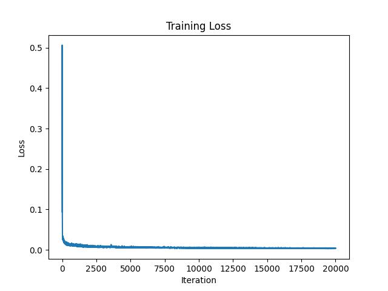

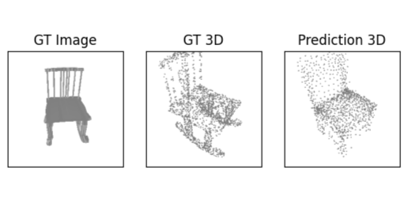

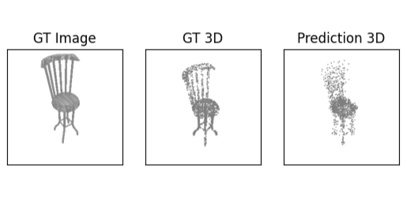

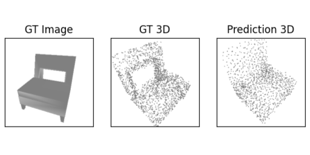

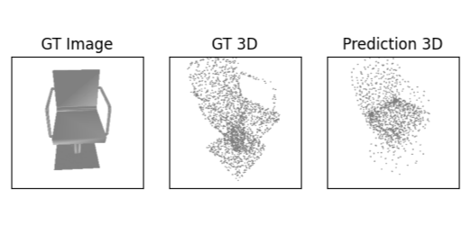

#### ResNet50

> Best Loss: 0.00276
>
> Same problem.
>
> Although the loss is very low, the points spread every where.
>
> From these results, I thinks it coverage.


### Voxel

#### Settings

* learning rate: 0.001
* weight decay: 0.01
* max iterations: 20000
* batch size: 256(ResNet18), 32(ResNet50)
* num workers: 4

#### ResNet18

> Best Loss: 0.00007
>
> The model overfits(maybe) perfectly.

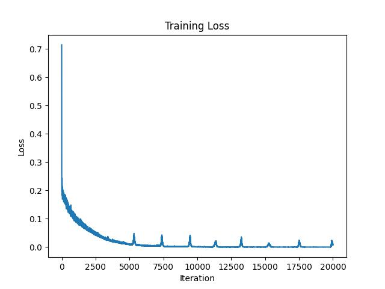

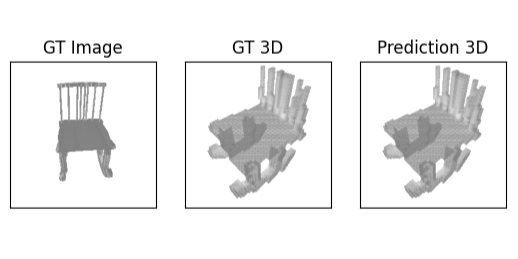

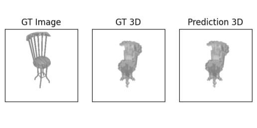

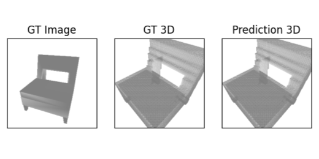

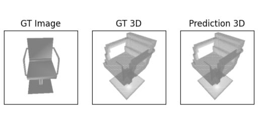

#### ResNet50

> Best Loss: 0.01257
>
> Due to not enough GPU memory space, the batch size is decreased.
>
> So, the model needs more iterations to coverage.
>
> But I think it will be like previous one overfitting perfectly👌.

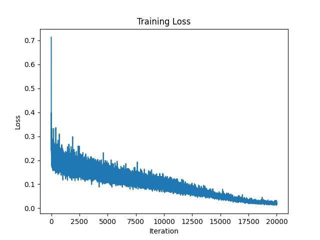

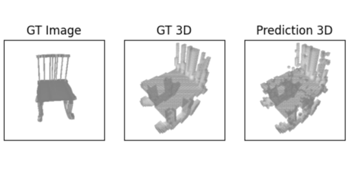

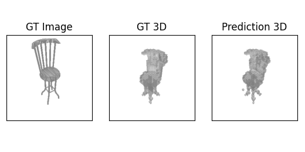

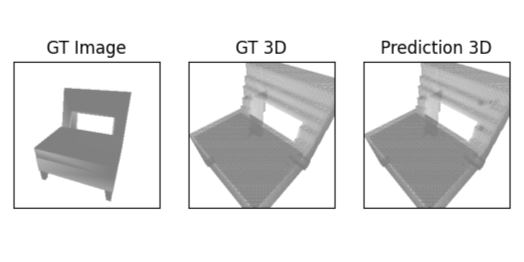

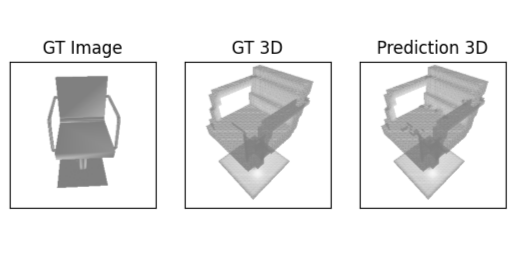